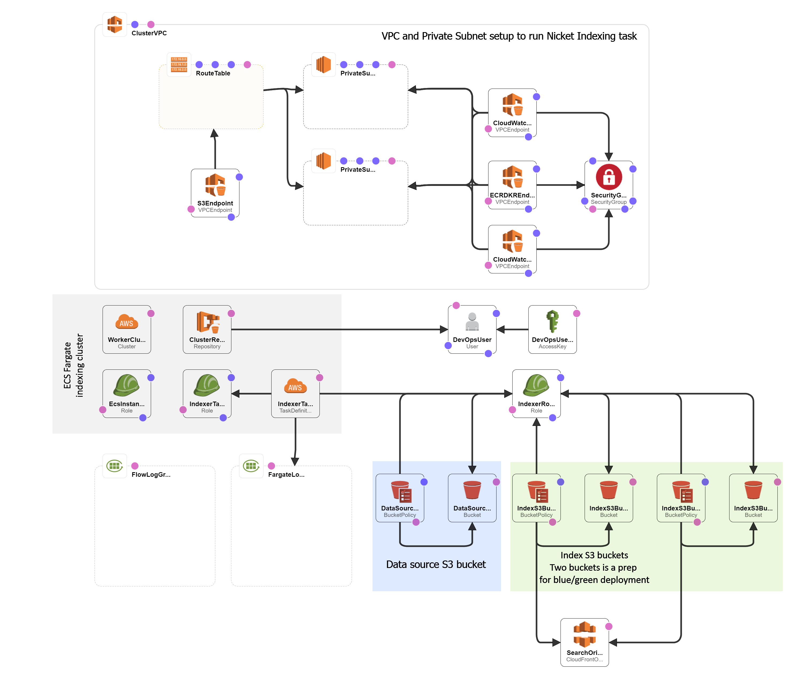

# Nickel Search Samples

This folder contains examples of using the library.

## TODO

1. Learn to remove the CF stack retaining S3 buckets. Or take the S3 buckets out of the cloudformation.
2. Finish the readme
3. Rerun the QA

## Local index

To start playing with Nickel, you can run this example locally. Just clone this repo, create an index directory, and run it. Take a look at the example source dataset that conains [about 2000 book names](../data/source) extracted from the 2019-04-30 [Open Library](https://openlibrary.org/) [dump](https://openlibrary.org/developers/dumps).

The following commands convert the source documents into a searchable index:

```bash
$> git clone git@github.com:aynurin/nickel-search.git
$> cd ./nickel-search
$> npm install
$> mkdir ./samples/data/index
$> npm run samples:index -- --data=./samples/data/source --index=./samples/data/index
$> npm run samples:search -- --index=./samples/data/index
```

## Run on AWS

Nickel is created to take advantage of AWS S3 for the index storage. In addition to that, in this example we will also run the indexer on AWS.

This example implements the following steps:

1. Creating the following AWS infrastructure:
    
2. Filling the Data Source with example data
3. Deploying the Indexer Docker container to the ECS Docker Registry
4. Running the Docker container to start indexing.

All but last steps are automated in the following command:

```bash
npm run samples:deployaws -- --aws-profile=<aws_cli_profile_name> --aws-region=<aws_region_name> --stack-name=<your_preferred_cloudformaion_stack_name>
```

In the output you will find another command that can be used to run the actual fargate ask for indexing.

## Thoughts on testing these examples

Before releasing, the following scenarios have to be tested:

1. Pull
2. Build a local index and search it from commandline
3. AWS fresh deploy, index, and search using HTTP
